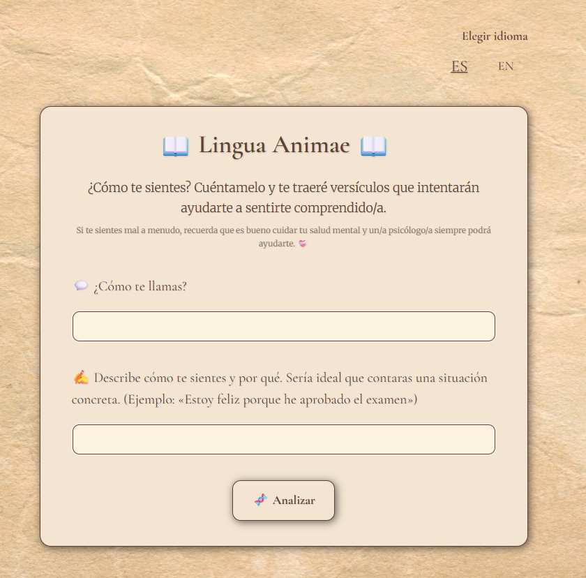
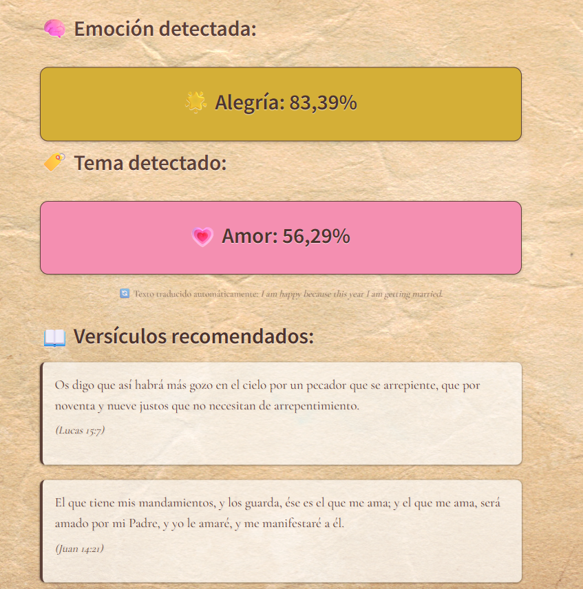
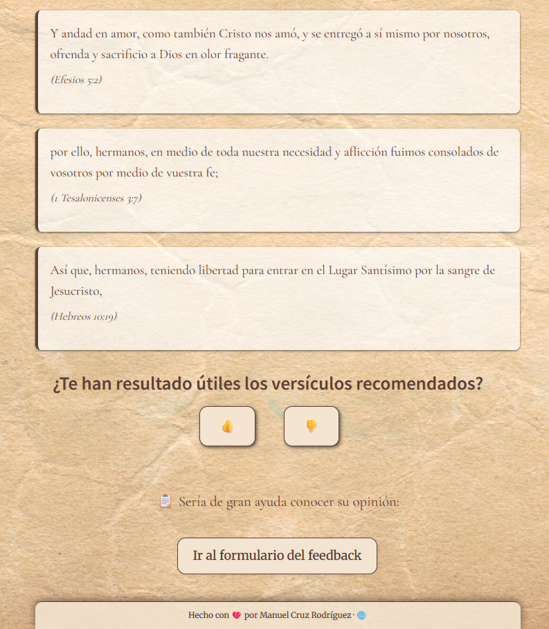

<p align="center">
  <a>
    
  </a>
</p>

<!-- 
<h1 align="center">
  <a style="text-decoration: none;">
    <span style="color: #4e342e; font-size: 2.8em; font-weight: bold;">📖 Lingua Animae</span>
  </a>
</h1> -->

<p align="center">
  <b>🤖 Classify, explore, and connect with sacred texts through emotion and theme. ❤️‍🩹</b><br>
  Multilingual NLP pipeline for emotion & theme annotation, with an interactive Streamlit chatbot for personalized Bible verse recommendations.
</p>

---

<p align="center">
    <a href="https://linguaanimae.streamlit.app/" style="text-decoration: none; font-size: 1.3em;">
        🟢 Try the Live Demo!
    </a>
</p>

---

## 📚 Table of Contents

- [🔍 Project Goals](#project-goals)
- [🧠 Core Technologies](#core-technologies)
- [📁 Project Structure](#project-structure)
- [📦 Data Folders Overview](#data-folders-overview)
- [🆕 Data Selection, Annotation & Versioning](#data-selection-annotation--versioning)
- [📝 Label Mapping and Cleaning](#label-mapping-and-cleaning)
- [🚦 Model Training & Evaluation](#model-training--evaluation)
- [📸 Screenshots](#screenshots)
- [🧰 Getting Started](#getting-started)
- [🧰 Usage](#usage)
- [💬 Streamlit Interface](#streamlit-interface)
- [📤 Feedback System](#feedback-system)
- [📊 Outputs](#outputs)
- [📌 Project Status (MVP Completed)](#project-status-mvp-completed)
- [⚠️ Known Limitations](#known-limitations)
- [🤝 Contributing & Testing](#contributing--testing)
- [📖 License](#license)
- [✨ Acknowledgements](#acknowledgements)

---

## 🔍 Project Goals

* Extract and normalize full Bible corpora (English + Spanish)
* Annotate every verse with emotion and theme labels
* Translate annotations for multilingual consistency
* Power a semantic chatbot that suggests aligned verses in real time
* Support additional domains like poetry or music lyrics (planned)

---

## 🧠 Core Technologies

* **Python 3.10+**
* `transformers`, `torch`, `sentence-transformers`
* `pandas`, `scikit-learn`, `regex`
* `beautifulsoup4`, `requests`
* `streamlit` – multilingual app for emotion/theme-based verse recommendation

---

## 📁 Project Structure

```
LinguaAnimae/
├── .streamlit/
│   └── secrets.toml
├── app/
│   ├── assets/
│   ├── components/
│   │   ├── render_emotion.py
│   │   ├── render_feedback.py
│   │   ├── render_theme.py
│   ├── app.py
│   └── texts.py
├── data/
│   ├── evaluation/
│   │   ├── verses_labeled_gpt/
│   │   ├── verses_parsed/
│   │   ├── verses_to_label/
│   │   ├── eval_examples.csv
│   │   └── eval_results.csv
│   ├── labeled/
│   ├── processed/
│   └── raw/
├── logs/
├── notebooks/
│   ├── 01_scraping_exploration.ipynb
│   ├── 02_cleaning.ipynb
│   ├── 03_label_emotions_and_themes.ipynb
│   ├── 04_translate_labels.ipynb
│   ├── 05_evaluation.ipynb
│   ├── 06_emotion_finetuning_pipeline.ipynb
│   └── viz_models.ipynb
├── src/
│   ├── fine_tuning/
│   │   ├── parse_gpt_output_to_labeled_csv.py
│   │   └── select_verses_for_labeling.py
│   │   └── prompt_gpt.txt
│   ├── interface/
│   │   └── recommender.py
│   ├── modeling/
│   │   ├── emotion_theme_labeling.py
│   │   ├── labeling_pipeline.py
│   │   └── theme_labeling.py
│   ├── preprocessing/
│   │   ├── cleaning.py
│   │   ├── merge.py
│   │   └── translate_and_apply_labels.py
│   ├── scraping/
│   │   ├── bible_scraper.py
│   │   └── parse_osis_kjv.py
│   └── utils/
│       ├── save_feedback_to_gsheet.py
│       └── translation_maps.py
├── tests/
├── .gitignore
├── requirements.txt
├── requirements_local.txt
├── environment.yml
├── README.md
├── CHANGELOG.md
```

---

## 📦 Data Folders Overview

| Folder                  | Description                                                                 |
|-------------------------|-----------------------------------------------------------------------------|
| `data/raw/`             | Raw, unprocessed texts as scraped from original sources (KJV/RV60 Bibles).  |
| `data/processed/`       | Cleaned and normalized texts, with basic formatting corrections.             |
| `data/labeled/`         | Verses annotated with emotion and theme labels.                             |
| `data/evaluation/`      | Evaluation sets, results, and samples for manual review.                    |
| `logs/`                 | Logs from annotation, training, and feedback collection.                    |
| `notebooks/`            | Jupyter notebooks documenting each stage of the pipeline.                   |


---

## 🆕 Data Selection, Annotation & Versioning

**Sampling, annotation, and batch tracking workflow:**

- Automated random verse selection script for new annotation rounds, guaranteeing no duplication of already labeled verses.
- Supports multiple annotation rounds with batch/version tracking (`emotion_verses_to_label_X.csv`).
- New annotation batches can be labeled via GPT or other models, then easily merged with existing datasets.
- Utility scripts included for remapping, cleaning, and validating emotion labels prior to model training.
- Each annotation batch and its integration is versioned for reproducibility and experiment traceability.

---

## 📝 Label Mapping and Cleaning

- **Robust label mapping:** All scripts and model pipelines use unified dictionaries for emotion and theme mapping (`EMOTION_MAP`, `THEME_MAP`), ensuring compatibility between annotation, translation, and modeling.
- **Label cleaning utilities:** Automated routines for handling strange/ambiguous emotions and mapping them to the canonical set. Out-of-vocabulary or inconsistent labels are filtered out before training.

---

## 🚦 Model Training & Evaluation

The project now supports full training and evaluation workflows for emotion classification models, including:

- Fine-tuning with Hugging Face Transformers on the annotated Bible corpus.
- Optional oversampling for class balancing during training.
- Comprehensive cross-validation pipeline using StratifiedKFold and HuggingFace Trainer, reporting mean and std of macro F1 across folds.
- Export of classification reports and confusion matrices after each experiment for documentation and analysis.
- Early stopping to prevent overfitting in all model workflows.

See `notebooks/05_evaluation.ipynb` and `src/fine_tuning/` for code examples and experiment tracking.

---

## 📸 Screenshots

The following screenshots illustrate the main functionalities of the Streamlit app at a glance:

<p align="center">
  <b>1. Home Screen: Input your message and select language</b><br>
  
</p>

<p align="center">
  <b>2. Recommendation Screen, part 1: The app suggests a Bible verse with detected emotion and theme</b><br>
  
</p>

<p align="center">
  <b>3. Recommendation Screen, part 2</b><br>
  
</p>

<p align="center">
  <b>4. Feedback Confirmation: User feedback is logged for model improvement</b><br>
  
</p>


---

## Getting Started

You can set up the environment using either `conda` (recommended) or `pip`.

### Option 1: Using Conda (recommended)

```bash
conda env create -f environment_local.yml
conda activate linguaanimae
```

### Option 2: Using pip

1. Clone the repository

```bash
git clone https://github.com/your-username/LinguaAnimae.git
cd LinguaAnimae
```

2. Create a virtual environment

```bash
python -m venv venv
source venv/bin/activate  # or .\venv\Scripts\activate on Windows
```

3. Install dependencies

```bash
pip install -r requirements.txt
```

4. Run the Bible scraper to download all books

```bash
python src/scraping/bible_scraper.py
```

---

## 🧰 Usage

### 1. Scrape the Bible (RV60)

Use the scraping script to extract the full Reina-Valera 1960 Bible and save it as structured CSVs:

```bash
python src/scraping/bible_scraper.py
```

### 2. Label Verses with Emotions + Themes

Use the labeling pipeline to classify English Bible verses (bible\_kjv) using pretrained HuggingFace models:

```bash
python src/interface/labeling_pipeline.py --bible bible_kjv
```

Optional flags:

* \--skip-emotion to skip emotion classification
* \--skip-theme to skip theme labeling
* \--device -1 to force CPU mode (default is --device 0 for GPU)
* \--dry-run path/to/file.csv to test a single file

### 3. Translate Labels into Spanish

Align the English emotion/theme annotations with their Spanish verse equivalents in bible\_rv60:

```bash
python src/preprocessing/translate_and_apply_labels.py
```

This creates a labeled Spanish version under:

```bash
data/labeled/bible_rv60/emotion_theme/
```

---

## 💬 Streamlit Interface

The interactive Streamlit app allows users to input a free-form emotional message and receive recommended Bible verses matching its **emotion** and **theme**.

### Features

* 🔄 **Automatic translation** of input (EN/ES)
* 🧠 **Emotion detection** (6 Ekman categories)
* 🏷️ **Theme classification** (5 canonical themes)
* 📖 **Context-aware verse matching** from KJV or RV60
* 🎨 **Stylized cards** with emotion/theme color, emoji, and verse metadata
* ✅ **User feedback collection** via like/dislike buttons (stored in Google Sheets)

### Example

Input:

> *Tengo miedo y necesito consuelo...*

Returns:

> *Génesis 40:7* — *"¿Por qué parecen hoy mal vuestros semblantes?"*

---

## 📤 Feedback System

Users can now rate the relevance of the emotion/theme detection with a 👍 / 👎 system.
Feedback is saved to a **Google Sheet** along with:

* Original input
* Detected emotion and score
* Detected theme and score
* User name (optional)
* Feedback value (`like` / `dislike`)

This enables future model refinement and analytics.

---

## 📊 Outputs

Labeled files are saved to:

* \*\_emotion.csv: Emotion column using 6 Plutchik labels
* \*\_emotion\_theme.csv: Adds multilabel theme column from 5 canonical themes
* Logs are saved to: logs/labeling\_logs/ with per-file runtime and pipeline summary

---

## 📌 Project Status (MVP Completed)

### ✅ MVP Completed (Weeks 1–6)
- [x] Full Bible scraping (KJV + RV60) and corpus organization
- [x] Data cleaning and normalization
- [x] Emotion and theme labeling using pretrained HuggingFace models
- [x] Cross-lingual label transfer and Spanish label alignment
- [x] Robust manual evaluation with accuracy, macro F1, and confusion matrix reporting
- [x] Streamlit interface: emotion + theme detection, stylized results, and interactive recommendations
- [x] Multilingual support: automatic input translation and dynamic corpus selection (EN/ES)
- [x] Recommendation system matching user queries by emotion and theme
- [x] Feedback system: like/dislike buttons with logging to Google Sheets
- [x] Model fine-tuning workflow: train/test split, metrics, early stopping, and artifact saving
- [x] Batch random sampling, annotation pipeline, and batch version tracking
- [x] Cross-validation pipeline (StratifiedKFold + HuggingFace Trainer) for robust evaluation
- [x] Automated report and confusion matrix export for each experiment

### 🚀 Future Work (Optional/Post-MVP)
- Export features (PDF), voice synthesis, or word cloud summaries
- Support for additional text domains (poetry, music, etc.)


[See CHANGELOG.md](CHANGELOG.md) for complete history.

---

## ⚠️ Known Limitations

While Lingua Animae demonstrates robust results as an MVP, the current version has several known limitations that future work may address:

- **Domain scope:** The annotation and recommendation pipeline is currently limited to biblical texts (KJV and RV60). Application to other genres (e.g., poetry, music lyrics) is planned but not yet implemented or validated.
- **Language support:** Only English and Spanish are fully supported at this time. Adding other languages would require further data preparation and model adaptation.
- **Emotion & theme taxonomy:** The emotion (6-class) and theme (5-class) taxonomies, while grounded in literature, are simplified for tractability and may not capture all nuances present in complex texts.
- **Annotation transfer:** The cross-lingual label transfer assumes strong verse alignment between English and Spanish Bibles; rare misalignments or translation differences may impact label accuracy.
- **Model bias:** Pretrained models used for annotation (e.g., HuggingFace Transformers) may inherit cultural or linguistic biases from their original training data, which could affect the detection of emotions or themes.
- **Evaluation set:** Manual evaluation is limited in scale and focuses on selected books/verses. Broader user validation or external benchmarks are desirable for production-level deployment.
- **Deployment:** The Streamlit app is designed for demonstration and user feedback. For large-scale or production use, backend scalability, security, and multi-user management would require further engineering.

---

## 🤝 Contributing & Testing

Contributions, suggestions, or bug reports are welcome!  
To run unit tests, use:

```bash
pytest tests/
```

For feature requests, open an issue or pull request on GitHub.

---

## 📖 License

For academic and research use only. Sources are derived from public domain Bibles (e.g., RV60, KJV) and open ML models from HugginFace. License will be finalized before v1.0.

---

## ✨ Acknowledgements

Developed by [Manuel Cruz Rodríguez](https://github.com/mancrurod) as part of an NLP and Data Science learning journey.
